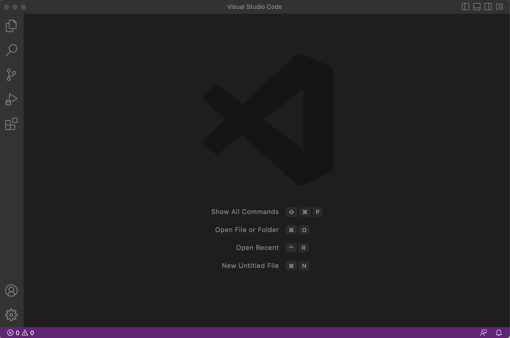

## Lab Report 1 - Ashton Bothun
1. Firstly, look up your CSE15L account to find your CSE15L account name, which will be an important step later. Do this by clicking [here](https://sdacs.ucsd.edu/~icc/index.php). From this site you will prompted to lookup an account, in which you should now enter your UCSD username and PID (starting with A, followed by your next seven digits). Once directed to the next page, go down under the "Additional Accounts" header and select the account starting with cs15lwi23, and ending with your custom characters. You have now looked up your CSE15L account, prompting you your username. 
---
2. The next step is installing and utilizing Visual Studio Code (aka VS Code) for its terminal. Go to this [link](https://code.visualstudio.com/), which is the download page for VS code. You should then click the download button in the top right which prompts you with the installations of VS Code for different operating systems. Click on the download (big blue button) that correlates to your operating system and begin the installation. Once the installation is done, launch VS Code and you have something like this:

3. Now is a matter of going on the terminal to gain access to the remote server. To open terminal on Windows, enter ctrl followed by back tick. On Mac, look at the top navigation and click "Terminal" then "New Terminal". Once the terminal is opened go back to step one where we found our CSE15L accounts, and copy your account name. Once in the terminal, type "ssh", followed by your account name, but after the "@", type ieng6, then continue with ".ucsd.edu". That should like this: 

