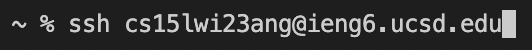
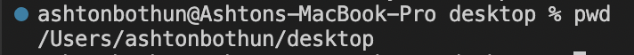

## Lab Report 1
1. Firstly, look up your CSE15L account to find your CSE15L account name, which will be an important step later. Do this by clicking [here](https://sdacs.ucsd.edu/~icc/index.php). From this site you will prompted to lookup an account, in which you should now enter your UCSD username and PID (starting with A, followed by your next seven digits). Note that the page will prompt you, asking you to chance your password, which will really, assign a password to your CSE15L account (you have the option to change your main UCSD password along with it as well if so desired). Once directed to the next page, go down under the "Additional Accounts" header and select the account starting with cs15lwi23, and ending with your custom characters. You have now looked up your CSE15L account, prompting you your username. 

---

2. The next step is installing and utilizing Visual Studio Code (aka VS Code) for its terminal. Go to this [link](https://code.visualstudio.com/), which is the download page for VS code. You should then click the download button in the top right which prompts you with the installations of VS Code for different operating systems. Click on the download (big blue button) that correlates to your operating system and begin the installation. Once the installation is done, launch VS Code and you have something like this:

--- 

3. Now is a matter of going on the terminal to gain access to the remote server. To open terminal on Windows, enter ctrl followed by back tick. On Mac, look at the top navigation and click "Terminal" then "New Terminal". Once the terminal is opened go back to step one where we found our CSE15L accounts, and copy your account name. Once in the terminal, type "ssh", followed by your account name, but after the "@", type ieng6, then continue with ".ucsd.edu". That should like this: 

Note that the last three digits before the "@" are my own digits, and will not work for you. After typing your access comand, press enter. Being that it is your first time connecting the the server, the terminal will prompt you, asking if you're sure that you want to connect to the server, displaying the options like such: "(yes/no/[fingerprint])". Type "yes" and upon so, you will be asked to type in your password. This password is the one connected to your CSE15L account which you assigned earlier in step 1. Please note that you have less leisure when typing your password, having no such indicator letting you know your current index. Once you are confident your password is successfully typed, press enter. If your password is correct you will be greeted and informed that you are logged into the server, if the password you entered is incorrect, try again. 

--- 

4. Finally, now that you have access to the remote server, you can start running commands. There are different commands that have different functions you could use in the terminal. For example, the command "pwd", prints the current working directory. This is how that looks: 

Now that you have a grasp of the idea, try running other commands like "ls", "mkdir", "cd", and "cp". And last but not least, to log out the remote server, use the command "exit". 
