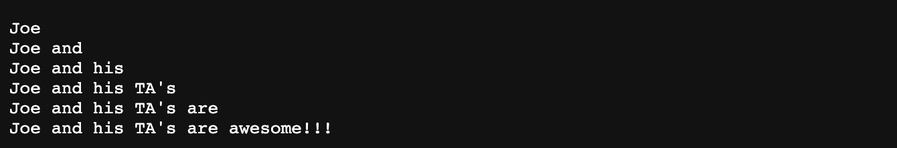
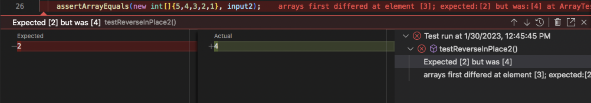

# Lab Report 2
## Part 1

Code for `StringServer`:


First screenshot using `/add-message`: 


Description: The methods called in StringServer.java are the `URLHandler` method and the `main` method. The relevant argument for `URLHandler` is a URI String that takes in an  `url` string as a parameter which runs through "if statements" that check for relevant fields which are specific elements in the inputted url and the `stringVar` String variable. The relevant fields that do change only when the method is ran successfully is the `stringVar` variable that gets updated and returned. For further clarification, the `URLHandler` method is properly used when the user enters a valid url, which will update and return `stringVar`, thus displaying the message on the server screen and adds all subsequent url inputs inputted from the user. As for the `main` method, this method uses a `port number` created by the user to then host a local server. The relevant fields for main remain the same throughout the whole time the server is up. The host can turn off the server in which the port, an int, number is able to changed.

---
Second screenshot using `/add-message`:


Description: In similar fashion as the last description, methods used are the `URLHandler` and the `main` method. For `URLHandler`, the relevant arguments are the inputted `url`s from the user. The relevant arugments change upon additional url inputs from the user, which all display on the server's screen. On the other hand, the `main` method is to be called allong with a four digit port number which hosts a local server that displays the url inputted from `URLHandler`. 

---

## Part 2

Bug Chosen: ReverseInPlace

Failure inducing input:
```
@Test
public void testReverseInPlace(){
int[] input = {1, 2, 3, 4, 5};
ArrayExamples.reverseInPlace(input);
assertArrayEquals(new int[]{5 , 4, 3, 2, 1}, input);
}
```

Non-failure inducing input: 
```
@Test
public void testReverseInPlace1(){
int[] input1 = {1, 1, 1, 1, 1};
ArrayExamples.reverseInPlace(input1);
assertArrayEquals(new int[]{1, 1, 1, 1, 1}, input1);
}
```

Failed case screenshot:



Passed case screenshot:


